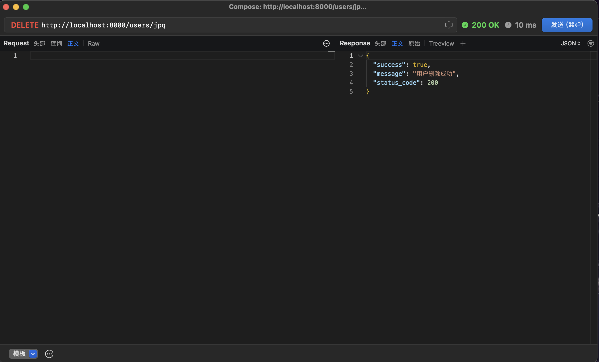

# HW10
吴一墨 3230103353
## 部署与运行
本次实验在github仓库[https://github.com/poorwym/WebGIS.git](https://github.com/poorwym/WebGIS.git),仓库已经设为public.
main.py中已经包含uvicorn的操作.只需要运行
```bash
python main.py
```
## 实验过程
本次实验实现了一个基于FastAPI的用户管理系统，提供完整的RESTful API服务，具备用户注册、登录验证、用户信息的增删改查等功能。整个系统采用了三层架构设计：API层、服务层和数据层，以确保代码的清晰性和可维护性。

### 2. 目录结构

```
/
├── api/                # API层，定义路由和端点
│   ├── login.py        # 登录相关API
│   └── users.py        # 用户管理相关API
├── schemas/            # 数据模型定义
│   ├── login.py        # 登录相关的请求和响应模型
│   └── user.py         # 用户相关的请求和响应模型
├── service/            # 服务层，实现业务逻辑
│   ├── login_service.py # 登录业务逻辑
│   └── user_service.py  # 用户管理业务逻辑
├── data/               # 数据存储
├── docs/               # 文档
│   ├── README.md       # 文档总览
│   ├── api_reference.md # API详细说明
│   ├── models.md       # 数据模型说明
│   ├── overview.md     # 项目概述
│   ├── testing.md      # 测试说明
│   └── validation.md   # 数据验证说明
├── test/               # 测试目录
│   ├── conftest.py     # 测试配置和fixtures
│   ├── test_login_api.py # 登录API测试
│   ├── test_main.py    # 应用主体测试
│   ├── test_users_api.py # 用户API测试
│   └── test_user_service.py # 用户服务测试
└── main.py             # 应用入口
```

### 3. 模块功能说明

#### 3.1 API层

API层负责处理HTTP请求和响应，定义了系统的路由和端点：

- **用户管理API** (`api/users.py`):
  - `POST /users/`: 创建新用户
  - `GET /users/`: 获取用户列表（支持分页和年龄过滤）
  - `GET /users/{username}`: 获取单个用户信息
  - `PUT /users/{username}`: 更新用户信息
  - `DELETE /users/{username}`: 删除用户

- **登录API** (`api/login.py`):
  - `POST /login/`: 验证用户凭据并返回登录状态

#### 3.2 数据模型层

使用Pydantic模型定义数据结构和验证规则：

- **用户模型** (`schemas/user.py`):
  - `User`: 基础用户模型
  - `UserCreate`: 用户创建模型
  - `UserUpdate`: 用户更新模型（所有字段可选）
  - `UserResponse`: 用户响应模型（不含敏感信息）

- **登录模型** (`schemas/login.py`):
  - `LoginRequest`: 登录请求模型
  - `LoginResponse`: 登录响应模型

#### 3.3 服务层

实现业务逻辑，处理数据验证和业务规则：

- **用户服务** (`service/user_service.py`): 
  - 用户注册：创建新用户，验证数据，存储用户信息
  - 用户查询：根据条件获取用户信息
  - 用户更新：验证和更新用户数据
  - 用户删除：删除用户账户
  
- **登录服务** (`service/login_service.py`):
  - 凭据验证：验证用户名和密码
  - 会话管理：生成和验证登录会话

### 4. 使用的技术

#### 4.1 核心框架和库

- **FastAPI**: 高性能Web框架，支持异步请求处理，自动生成OpenAPI文档
- **Pydantic**: 数据验证和类型提示库，用于请求/响应模型定义和验证
- **Uvicorn**: ASGI服务器，用于部署FastAPI应用

#### 4.2 数据验证机制

- 基于Pydantic模型的数据验证系统
- 自定义字段验证器（Field Validators）
- 验证规则：
  - 用户名：至少3个字符
  - 密码：至少8个字符，包含至少一个大写字母和一个数字
  - 邮箱：有效的邮箱格式（使用EmailStr类型）
  - 年龄：0-100之间的整数

#### 4.3 测试技术

- **pytest**: 测试框架
- **FastAPI TestClient**: 用于API测试
- 测试覆盖：
  - API集成测试
  - 服务层单元测试
  - 错误处理和边界条件测试

#### 4.4 架构模式

- 三层架构（API层、服务层、数据层）
- 依赖注入（Dependency Injection）
- 路由和端点模块化

### 5. 测试详情 (这一部分主要由ai维护)

项目包含了全面的测试套件，确保系统的功能正确性、稳定性和健壮性。测试覆盖了从服务层到API层的所有关键功能，并特别关注了数据验证和错误处理机制。

#### 5.1 测试文件组织

- **conftest.py**: 包含测试配置和pytest fixtures，提供测试客户端实例和应用实例
- **test_main.py**: 测试应用主入口，验证根路由的基本功能
- **test_login_api.py**: 测试登录API的功能，包括成功和失败的场景
- **test_users_api.py**: 测试用户管理API的各项功能
- **test_user_service.py**: 测试用户服务层的功能和数据验证逻辑

#### 5.2 用户服务测试 (test_user_service.py)

服务层测试重点验证业务逻辑和数据处理：

- **基础CRUD操作测试**:
  - `test_register_user`: 测试用户注册功能
  - `test_get_users`: 测试获取用户列表功能，包括分页和年龄筛选
  - `test_update_user`: 测试更新用户信息
  - `test_delete_user`: 测试删除用户功能

- **数据验证测试**:
  - `test_user_validation`: 测试用户数据的基本验证规则
  - `test_register_user_validation_errors`: 测试注册时的验证错误处理
  - `test_update_user_validation_errors`: 测试更新用户时的验证错误处理
  - `test_pydantic_validation_error_handling`: 测试Pydantic验证错误的处理机制

#### 5.3 用户API测试 (test_users_api.py)

API层测试重点验证HTTP请求处理和响应：

- **参数验证测试**:
  - `test_get_users_parameters`: 使用参数化测试验证获取用户API的参数处理
  
- **用户注册API测试**:
  - `test_register_user`: 测试正常注册流程
  - `test_register_user_invalid_data`: 测试无效数据的处理
  - `test_register_user_validation_details`: 测试具体验证错误的详细信息

- **用户管理API测试**:
  - `test_get_user_by_username`: 测试获取单个用户信息
  - `test_update_user`: 测试更新用户信息
  - `test_delete_user`: 测试删除用户
  - `test_update_user_validation_details`: 测试更新用户时的验证错误详情

#### 5.4 登录API测试 (test_login_api.py)

- `test_login_success`: 测试成功登录的场景
- `test_login_failure`: 测试登录失败的场景，验证错误响应

#### 5.5 主应用测试 (test_main.py)

- `test_read_root`: 测试应用根路由返回正确的响应

#### 5.6 测试方法和技术

- **模拟和打补丁**: 使用unittest.mock中的patch和monkeypatch来模拟服务行为
- **参数化测试**: 使用pytest.mark.parametrize测试不同的输入组合
- **异常测试**: 使用with pytest.raises验证预期的异常
- **断言**: 使用assert验证测试结果

#### 5.7 测试运行与覆盖率

可以通过以下命令运行测试：
- 运行所有测试: `pytest`
- 运行特定文件: `pytest test/test_user_service.py`
- 运行特定函数: `pytest test/test_user_service.py::test_register_user`

如需生成测试覆盖率报告，需要先安装pytest-cov插件：
```bash
pip install pytest-cov
```

然后可以运行以下命令生成覆盖率报告：
```bash
pytest --cov=service --cov=schemas
```

生成HTML格式的覆盖率报告：
```bash
pytest --cov=service --cov=schemas --cov-report=html
```

## 实验结果
### pytest测试结果
```bash
=============================================================== test session starts ================================================================
platform darwin -- Python 3.12.2, pytest-7.4.4, pluggy-1.0.0
rootdir: /Users/alexwu/project/WebGIS/HW10
plugins: xonsh-0.18.4, langsmith-0.3.21, anyio-4.2.0, cov-6.1.1
collected 37 items                                                                                                                                 

test/test_login_api.py ....                                                                                                                  [ 10%]
test/test_main.py .                                                                                                                          [ 13%]
test/test_user_service.py ...................                                                                                                [ 64%]
test/test_users_api.py .............                                                                                                         [100%]

================================================================== tests coverage ==================================================================
_________________________________________________ coverage: platform darwin, python 3.12.2-final-0 _________________________________________________

Name                       Stmts   Miss  Cover
----------------------------------------------
schemas/__init__.py            0      0   100%
schemas/login.py               7      0   100%
schemas/user.py               45      3    93%
service/__init__.py            2      0   100%
service/login_service.py      10      0   100%
service/user_service.py       68      7    90%
----------------------------------------------
TOTAL                        132     10    92%
================================================================ 37 passed in 0.17s ================================================================
```
可以看出,总体测试覆盖率达到92%,还是很高的.
### 人工测试结果
采用proxyman进行测试.
- GET: 获取全部用户

- GET: 获取单个用户
  - 用户存在:

  - 用户不存在:

- POST: 创建用户

- DELETE: 删除用户

- PUT: 更新用户

查看数据后密码也完成了相应修改.
- POST: 登陆
  - 成功
  
  - 失败
  