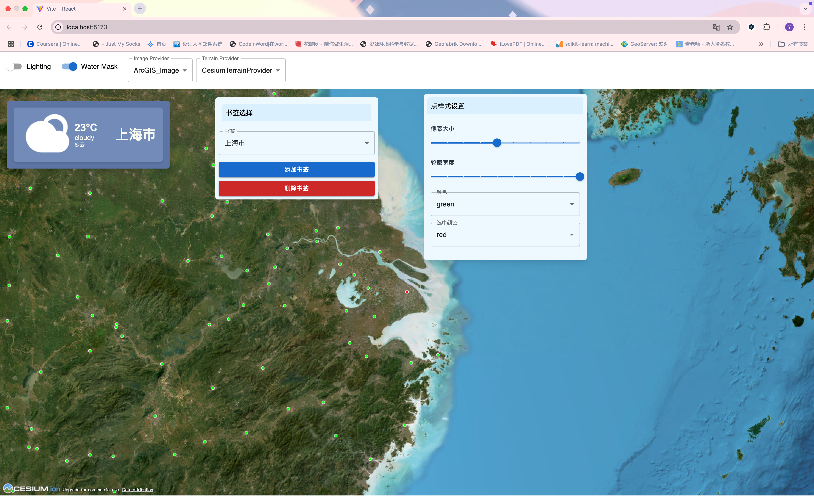

# HW7实验报告

## 项目地址
https://github.com/poorwym/WebGIS.git
同步在HW7文件夹,已经设为public

## 使用方法

- 安装依赖
```bash
npm install
```

- 运行服务器
```bash
npm run dev
```

## 技术栈
- 前端框架：React + Vite
- 地图引擎：Cesium
- 状态管理：React Hooks
- 样式管理：CSS + Tailwind CSS + MaterialUI

## 实验过程


- 添加左键拾取
```jsx
// 添加点击事件监听器
      newViewer.screenSpaceEventHandler.setInputAction((movement) => {
        const pickedObject = newViewer.scene.pick(movement.position);
        if (Cesium.defined(pickedObject) && pickedObject.id) {
          const entity = pickedObject.id;
          
          // 获取点击的城市名称
          if (entity.properties && entity.properties.cityName) {
            const cityName = entity.properties.cityName.getValue();
            console.log("选中城市:", cityName);
            
            // 如果有传入的onCitySelect函数，可以调用它来更新App组件中的city状态
            if (onCitySelect) {
              onCitySelect(cityName);
            }
            
            // 飞行到选中的城市
            const cityData = cityList.find(city => city.name === cityName);
            if (cityData) {
              const [lon, lat] = cityData.centerPoint.split(',').map(Number);
              newViewer.camera.flyTo({
                destination: Cesium.Cartesian3.fromDegrees(lon, lat, 1500000.0)
              });
            }
          }
        }
      }, Cesium.ScreenSpaceEventType.LEFT_CLICK);
```

- 构建书签选择器
```jsx
const handleAddBookmark = () => {
        if (bookmarks.includes(city)) {
            alert("该城市已存在书签中");
            return;
        }
        alert("添加书签成功");
        setBookmarks([...bookmarks, city])
        setSelectedBookmark(city)
    };

    const handleRemoveBookmark = () => {
        if (!bookmarks.includes(city)) {
            alert("该城市不存在书签中");
            return;
        }
        
        // 保存新的书签列表（移除当前城市）
        const newBookmarks = bookmarks.filter(bookmark => bookmark !== city);
        
        // 更新书签状态
        setBookmarks(newBookmarks);
        
        // 检查剩余书签数量
        if(newBookmarks.length > 0) {
            // 选择下一个书签
            setSelectedBookmark(newBookmarks[0]);
            setCity(newBookmarks[0]);
        }
        
        alert("删除书签成功，剩余书签：" + newBookmarks.length);
    };
```
- 修改天气面板
注释掉weather组件中的其余部分
```jsx
 {/*<div className='w-full flex flex-row items-center justify-between pr-4'>
                <CitySelector city={city} onCityChange={onCityChange}/>
                <Title />
            </div>
            <LatAndLon lat={coordinates.lat.toFixed(2)} lon={coordinates.lon.toFixed(2)} />
            <SubmitButton function={getWeather} city={city}/>}*/}
```
## 实验结果
实现功能
- 添加点击拾取，摄像机飞行到指定区域
- 可以添加书签与删除书签
- 修改天气面板
